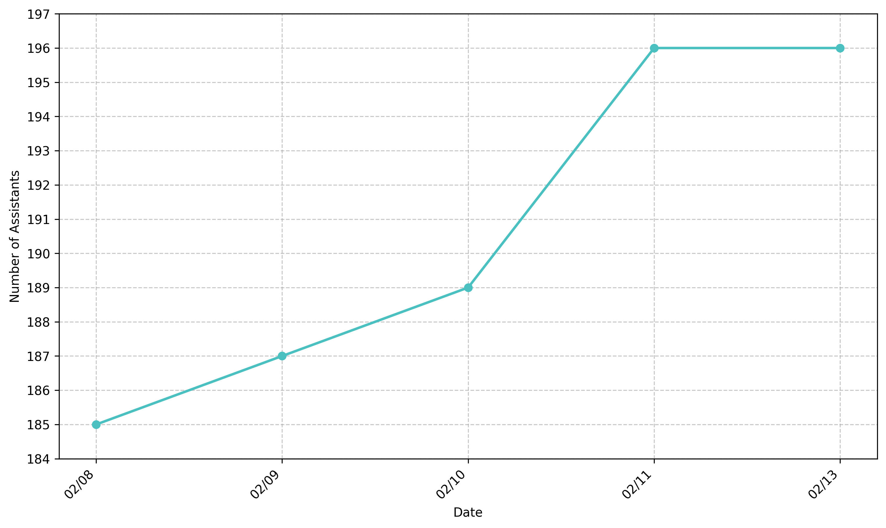

# 🤖 AI Assistant Configuration Library

 
 
## 🎯 Key Features

- **Extensive Collection**: 166+ specialized AI assistant configurations
- **Platform Flexibility**: System prompts can be extracted and used with any AI platform
- **Organized Categories**: Well-structured library covering diverse domains
- **Special Capabilities**: Support for vision, RAG, and internet-enabled features

### Assistant Capability Indicators

| Symbol | Meaning |
|--------|---------|
| 👁️ | Vision Capabilities Required |
| 📚 | RAG (Retrieval-Augmented Generation) Enabled |
| 🌐 | Internet Access Required |

## 🚀 Usage Options

### Using with Dify.AI
1. Select an assistant configuration from the appropriate category
2. Import the YAML file into your Dify.AI instance
3. Deploy and start interacting

### Using with Other Platforms
1. Extract the system prompt from the YAML configuration
2. Adapt the prompt for your chosen AI platform
3. Implement any required capabilities (vision, RAG, etc.)

> **Note**: Check capability indicators (👁️, 📚, 🌐) to ensure your platform supports required features.

<!-- ASSISTANT_INDEX_START -->
- 🤖 **Dev Prompt Improver**   (2025-02-13)
- 🤖 **Email Thread - Summarise & Respond**   (2025-02-13)
- 🤖 **Text Formalistaion Bot**   (2025-02-13)
- 🤖 **William Shakespeare**   (2025-02-13)
- 🤖 **Audio Analysis Tester**   (2025-02-11)
- 🤖 **If You Liked This**   (2025-02-11)
- 🤖 **Israel Entertainment Options**   (2025-02-11)
- 🤖 **Vision Capability Tester**   (2025-02-11)
- 🤖 **Realtime Video Tester**   (2025-02-11)
- 🤖 **Confused AI Bot**   (2025-02-11)
- 🤖 **Home Assistant Widget Editor (1)**   (2025-02-10)
- 🤖 **Screenplay This Email Thread**   (2025-02-09)
- 🤖 **Cognitive Distortions Modeller**   (2025-02-09)
- 🤖 **How Do You See Me**   (2025-02-09)
- 🤖 **I Was On Break**   (2025-02-09)
- 🤖 **Relentless Upseller Bot**   (2025-02-09)
- 🤖 **Standoffish AI Tool**   (2025-02-09)
- 🤖 **Radical Career Advisor**   (2025-02-09)
- 🤖 **Outlandish Solutions Guy**   (2025-02-09)
- 🤖 **Just Google It**   (2025-02-09)
- 🤖 **Did You Try Turning It On And Off**   (2025-02-09)
- 🤖 **Deliberately Bad AI Bot**   (2025-02-09)
- 🤖 **Find Me A Terrible Movie**   (2025-02-09)
- 🤖 **AI Raise Monitor**   (2025-02-08)
- 🤖 **Storage Solution Ideator (1)**   (2025-02-08)
- 🤖 **CSV To JSON**   (2025-02-08)
- 🤖 **More Agents, Please**   (2025-02-08)
- 🤖 **Postgres Taxonomy Building Assistant**   (2025-02-08)
- 🤖 **Synthetic PII Data Generation Assistant**   (2025-02-08)
- 🤖 **The Postgres Schema Genie**   (2025-02-08)
- 🤖 **Taxonomy Ideation Wizard**   (2025-02-08)
- 🤖 **Screenshot To Data**   (2025-02-08)
- 🤖 **Document Table Finder**   (2025-02-08)
- 🤖 **Configuration Editing Assistant**   (2025-02-07)
- 🤖 **Dimensions Estimator**   (2025-02-07)
- 🤖 **Provide Product Descriptions**   (2025-02-07)
- 🤖 **Product Data Extraction**   (2025-02-07)
- 🤖 **A Day In AI Land**   (2025-02-07)
- 🤖 **Assistant and Agent Use Case Ideation Bot**   (2025-02-07)
- 🤖 **Embrace AI Career Coach**   (2025-02-07)
- 🤖 **Large Language Model Assistant Configuration Generator**   (2025-02-07)
- 🤖 **Workflow Automation Advisor**   (2025-02-07)
- 🤖 **Beer Tap Identifier**   (2025-02-07)
- 🤖 **ChatMate**   (2025-02-07)
- 🤖 **Clod**   (2025-02-07)
- 🤖 **Competitive Landscape Analysis Assistant**   (2025-02-07)
- 🤖 **Gmail Search String Generator**   (2025-02-07)
- 🤖 **YAML Doctor**   (2025-02-07)
- 🤖 **Statistic Finder**   (2025-02-07)
- 🤖 **Contract Review Agent**   (2025-02-07)
- 🤖 **Context Data Extraction Tool**   (2025-02-07)
- 🤖 **Data Visualization Ideator (Alternative Suggester)**   (2025-02-07)
- 🤖 **Dummy Tech Project Ideator**   (2025-02-07)
- 🤖 **LLM Usage Coach**   (2025-02-07)
- 🤖 **Memory Aid Helper**   (2025-02-07)
- 🤖 **Prompt Improvement Agent**   (2025-02-07)
- 🤖 **Image To Text Recommendation Agent**   (2025-02-07)
- 🤖 **Automation Brainstormer**   (2025-02-07)
- 🤖 **Brainstorming Encourager**   (2025-02-07)
- 🤖 **Backup Planning Assistant**   (2025-02-07)
- 🤖 **Agenda Generation Assistant**   (2025-02-07)
- 🤖 **Natural Language To JSON**   (2025-02-07)
- 🤖 **Code Generation Assistant**   (2025-02-07)
- 🤖 **Add Examples To Prompt**   (2025-02-07)
- 🤖 **Which Large Language Model**   (2025-02-07)
- 🤖 **Guess The LLM**   (2025-02-07)
- 🤖 **Medieval Text Generation Assistant**   (2025-02-07)
- 🤖 **Random AI Assistant Ideator**   (2025-02-07)
- 🤖 **Python GUI Generation Assistant**   (2025-02-07)
- 🤖 **Gifted Adult Helper**   (2025-02-07)
- 🤖 **Sensory Processing Support Assistant**   (2025-02-07)
- 🤖 **Shields.io Badge Generator**   (2025-02-07)
- 🤖 **Ridiculous Sloth Photo Generator**   (2025-02-07)
- 🤖 **Sonnet 3.5 - Modified**   (2025-02-07)
- 🤖 **Stack Research Prompt Optimiser**   (2025-02-07)
- 🤖 **Tech Stack Optimiser**   (2025-02-07)
- 🤖 **Voice Note Journalling Assistant**   (2025-02-07)
- 🤖 **Go Sell Yourself!**   (2025-02-07)
- 🤖 **Company News Retrieval Assistant**   (2025-02-07)
- 🤖 **Job Search Accountability Partner**   (2025-02-07)
- 🤖 **Harsh HR Agent Simulator**   (2025-02-07)
- 🤖 **Career Exploration Assistant**   (2025-02-07)
- 🤖 **Grow With My Job**   (2025-02-07)
- 🤖 **Similar AI Tool Finder**   (2025-02-07)
- 🤖 **Remote Job Identification Tool**   (2025-02-07)
- 🤖 **Salary Research Sidekick**   (2025-02-07)
- 🤖 **Alien Visitor**   (2025-02-07)
- 🤖 **Cornelius the Sloth**   (2025-02-07)
- 🤖 **Grumpy LLM**   (2025-02-07)
- 🤖 **LLMs People And Orgs**   (2025-02-07)
- 🤖 **Misery Loves Company**   (2025-02-07)
- 🤖 **Sloth Metaphor Explainer**   (2025-02-07)
- 🤖 **Who's This Person**   (2025-02-07)
- 🤖 **Daniel's Entertainment Helper**   (2025-02-07)
- 🤖 **True Story Movie & Documentary Finder**   (2025-02-07)
- 🤖 **1-Star Review Explorer**   (2025-02-07)
- 🤖 **Shakespeare My Email**   (2025-02-07)
- 🤖 **Typo Master**   (2025-02-07)
- 🤖 **Geopolitical Event Simulator**   (2025-02-07)
- 🤖 **Boundary Setting Roleplay Coach**   (2025-02-07)
- 🤖 **Narcissistic & Emotional Abuse  Gaslighting Recognition Coach**   (2025-02-07)
- 🤖 **Gaslighting Guardian**   (2025-02-07)
- 🤖 **Toxic Email Parser**   (2025-02-07)
- 🤖 **General Purpose Personal Assistant**   (2025-02-07)
- 🤖 **Business Continuity Advisor**   (2025-02-07)
- 🤖 **Decluttering Assistant**   (2025-02-07)
- 🤖 **Disaster Debrief Assistant**   (2025-02-07)
- 🤖 **Communications Strategist On Call**   (2025-02-07)
- 🤖 **News Article Summary Generator**   (2025-02-07)
- 🤖 **Open Access Data Finder**   (2025-02-07)
- 🤖 **Eco Ninja 3**   (2025-02-07)
- 🤖 **Script Generation Agent**   (2025-02-07)
- 🤖 **Agent #42**   (2025-02-07)
- 🤖 **Social Awkwardness Engineer**   (2025-02-07)
- 🤖 **Airport Food Finder**   (2025-02-07)
- 🤖 **Aliexpress Brand Counterfeiting Vetter**   (2025-02-07)
- 🤖 **Brand Reliability Assistant**   (2025-02-07)
- 🤖 **Linux Hardware Finder**   (2025-02-07)
- 🤖 **Rugged Product Locator**   (2025-02-07)
- 🤖 **Shopping Assistant Configuration**   (2025-02-07)
- 🤖 **Sustainable Living Advisor**   (2025-02-07)
- 🤖 **Sustainability Regulation Guide**   (2025-02-07)
- 🤖 **Acronym-to-Organisation Assistant**   (2025-02-07)
- 🤖 **Template Response Genie**   (2025-02-07)
- 🤖 **Computer Output Errors**   (2025-02-07)
- 🤖 **Is There A Tech For That**   (2025-02-07)
- 🤖 **Timesheet Generator**   (2025-02-07)
- 🤖 **Adversarial Contract Negotiator**   (2025-02-07)
- 🤖 **Startup Idea Capturer**   (2025-02-07)
<!-- ASSISTANT_INDEX_END -->
